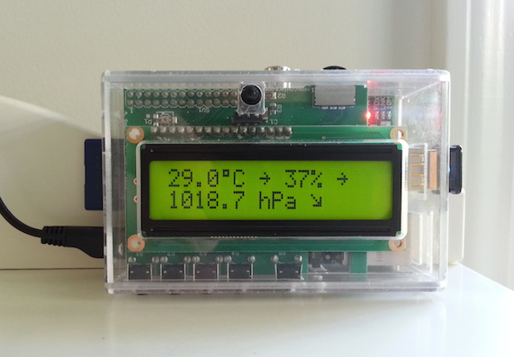

# pifacecad-wdlive

Copyright © 2015 Wayne D Grant

Licensed under the MIT License

[Weather Display Live](http://www.weather-display.com/wdlive.php) Clone for PiFace Control and Display (pifacecad). Written in Python.

## Overview

pifacecad-wdlive is a simple weather display console.

pifacecad-wdlive can be configured on the command line to read and display data from any
WD Live clientraw.txt file available on the web via http.
It polls the specified file once a minute updating the pifacecad's display with the new data.

pifacecad-wdlive supports the display of many different weather items and measurement units.

It can optionally work with an IR remote control via LIRC.



## Requirements

1. Raspberry Pi
2. PiFace Control and Display
3. pifacecad installation for Python 3 (http://piface.github.io/pifacecad/installation.html)
4. IR Remote control (optional)

## Installation

Download the source code for the [latest release](https://github.com/waynedgrant/pifacecad-wdlive/releases) and unzip it on your Raspberry Pi

## Execution

```
$ cd pifacecad-wdlive
$ python3 pifacecad-wdlive.py [clientraw.txt url]
```

For example:

```
$ python3 pifacecad-wdlive.py http://www.waynedgrant.com/weather/meteohub/clientraw.txt
```

## Controls

* **Button 1** - change temperature units
* **Button 2** - change pressure units
* **Button 3** - change wind speed units
* **Button 4** - change wind direction units
* **Button 5** - change rainfall units
* **Toggle Push** - toggle backlight
* **Toggle Left** - previous weather item
* **Toggle Right** - next weather item

## Error Messages

* **CLIENTRAW IS UNAVAILABLE** - Cannot fetch clientraw.txt because of an incorrect URL or a networking issue
* **CLIENTRAW IS EMPTY** - clientraw.txt is empty, possibly because the poll happened when the file was being updated by Weather Display
* **CLIENTRAW IS INVALID** - Specified URL is not a valid clientraw.txt file

## IR Installation

* Setup LIRC on pifacecad - http://piface.github.io/pifacecad/lirc.html#setting-up-the-infrared-receiver
* Copy example lircrc file for Xbox 360 remote from pifacecad-wdlive/.lircrc to home directory
* Modify button assignments to match your remote control

### Example Xbox 360 Remote Button Controls

* **1** - change temperature units
* **2** - change pressure units
* **3** - change wind speed units
* **4** - change wind direction units
* **5** - change rainfall units
* **OK** - toggle backlight
* **Left Arrow** - previous weather item
* **Right Arrow** - next weather item

## Weather Items

1. Summary (outdoor temperature, outdoor humidity, surface pressure)
2. Forecast
3. Outdoor Temperature with Trend
4. Surface Pressure with Trend
5. Outdoor Humidity with Trend
6. Average Wind Speed and Direction
7. Gust Speed
8. Daily Rainfall
9. Rainfall Rate
10. Dew Point
11. Wind Chill
12. Heat Index
13. Humidex
14. UV Index
15. Indoor Temperature and Humidity
16. Last Update Time

## Supported Measurement Units

### Temperature

* Celsius (°C)
* Fahrenheit (°F)

### Surface Pressure

* Hectopascals (hPa)
* Inches of Mercury (inHg)
* Kilopascals (kPa)
* Millibars (mb)
* Millimetres of Mercury (mmHg)

### Wind Speed

* Beaufort Scale (Bft)
* Kilometres per Hour (kph)
* Knots (kts)
* Metres per Second (m/s)
* Miles per Hour (mph)

### Wind Direction

* Cardinal Direction (16 points)
* Compass Degreess

### Rainfall

* Inches
* Millimetres
